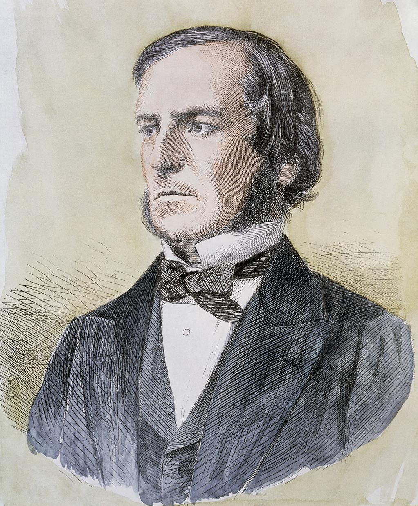
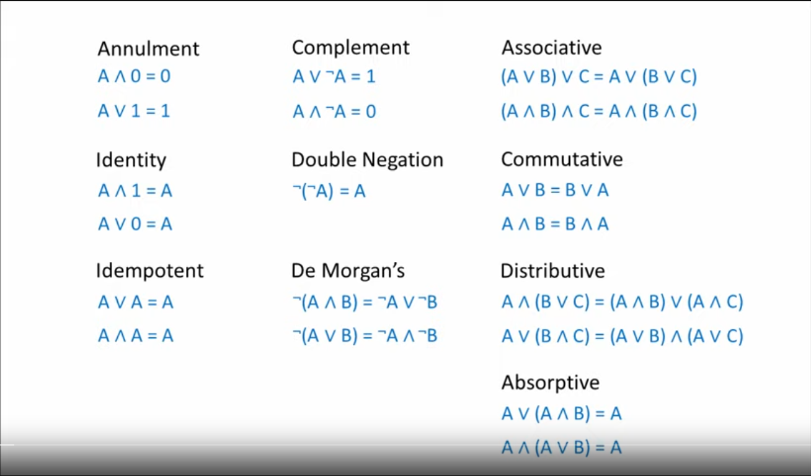
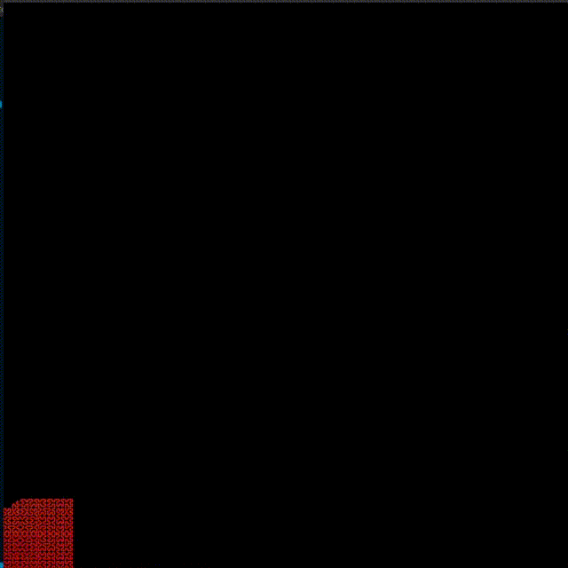

## Ready Set Boole

## Key Concepts
- Boolean algebra
- Set Theory
- Space filling curves
- Half adder, Full adder
- Karnaugh map 
- Gray code
- Truth Tables
- Reverse polish form notation
- Negation normal form
- Conjunctive normal form
- Boolean satisfiability problem (SAT)
- Hilbert Curve
- Groups mathematical structure
- Morphisms

## Boolean algebra
Boolean algebra is a branch of mathematics that deals with variables that have two distinct values: true (1) and false (0). Named after George Boole, it is fundamental in digital logic design and computer science.



## Set Theory
Set theory is a fundamental branch of mathematics that studies collections of objects

## Gray code
Gray code, or reflected binary code, is a binary numeral system where two successive values differ in only one bit. It’s commonly used in digital systems to prevent errors during the transition between consecutive values.
gray_code(n) = n ^ (n >> 1)

## Negation normal form and Conjunctive normal form
Negation Normal Form (NNF) and Conjunctive Normal Form (CNF) are ways to standardize logical expressions in Boolean algebra. 

**NNF**
- Negations is directly applied to variables.
- The expression uses only AND  and OR operators besides NOT.
- ¬(A⋅B)=¬A+¬B

**CNF**
- An expression that is a conjunction (AND) of one or more clauses, where each clause is a disjunction (OR) of literals (variables or their negations).
Example:
$$ 
(A1​+B1​+¬C1​)⋅(A2​+¬B2​+C2​)⋅…⋅(An​+Bn​+Cn​)
$$

## Boolean satisfiability problem (SAT)
- The Boolean satisfiability problem (SAT) is a fundamental problem in computer science and mathematical logic. It involves determining whether there exists an assignment of truth values (true or false) to variables that makes a given Boolean formula true.
- SAT is NP-complete


## Space filling curves
- Space-filling curves are mathematical constructs that map a `one-dimensional line` into a `higher-dimensional space`, such as a `plane` or a `volume`, in a `continuous` manner.

- hilbert curve


## How to run
```
install rust => https://www.rust-lang.org/tools/install

cargo test [test_name]
    test_adder
    test_multiplier
    test_gray_code
    test_eval_formula
    test_print_truth_table
    test_negation_normal_form
    test_conjunctive_normal_form
    test_sat
    test_powerset
    test_eval_set
    test_map_reverse_map

cargo run --release
```



## Resources
- [Subject](./static/ready%20set%20boole.pdf)
- [Boolean Algebra](https://www.youtube.com/playlist?list=PLTd6ceoshprcTJdg5AI6i2D2gZR5r8_Aw)
- [set theory cheat sheet](http://www.toomey.org/tutor/harolds_cheat_sheets/Harolds_Sets_Cheat_Sheet_2022.pdf)
- [mathématiques Les fondements](http://alain.troesch.free.fr/2023/Fichiers/coursMP2I-fondements.pdf)
- [Hilbert's Curve](https://www.youtube.com/watch?v=3s7h2MHQtxc&t=496s)
- [Group theory, abstraction](https://www.youtube.com/watch?v=mH0oCDa74tE)


